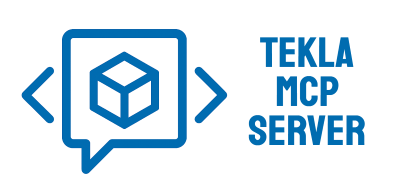

[](https://github.com/teknovizier/tekla_mcp_server/actions/workflows/python-tests.yml)
[](https://github.com/teknovizier/tekla_mcp_server/blob/main/README.md#requirements)
[](https://github.com/teknovizier/tekla_mcp_server/blob/main/LICENSE)



# Tekla MCP Server

This server facilitates interaction with **Tekla Structures**, helping users speed up modeling processes. It acts as a bridge between users and Tekla, enabling automated workflows and improving efficiency.

> #### 📌 What is MCP?
>
> *MCP* stands for **Model Context Protocol**, and it is a communication protocol introduced by Anthropic to enable more efficient and secure interactions between large language models and other systems, such as human users or other AI agents.
>
> **Tekla MCP Server** uses AI-powered natural language processing to make interactions more human-readable, allowing you to work with a set of tools using plain text.

To use this server, users must first install and configure an MCP client.

### Tools
The server provides the following tools:

| Category | Tool | Description | Parameters |
|----------|------|-------------|------------|
| Selection | `select_elements_by_filter` | Select elements in Tekla model based on type/Tekla class, name, profile, material, finish and phase. Supports complex filters with AND/OR logic | `element_type`, `tekla_classes`, `standard_string_filters`, `custom_string_filters`, `custom_numeric_filters`, `combine_with` |
| Selection | `select_elements_by_filter_name` | Select elements in Tekla model based on a predefined filter | `filter_name` (required) |
| Selection | `select_elements_by_guid` | Select elements in Tekla model by their GUID | `guids` (required) |
| Selection | `select_elements_assemblies_or_main_parts` | Get assemblies or main parts for the selected elements and select them | `mode` (required): Assembly or Main Part |
| Components | `put_components` | Insert Tekla components with optional semantic attribute mapping that converts user-friendly names (e.g., "rebar size") to config keys (e.g., "SBSize_list"). Supports intelligent components like `Lifting Anchor` with automatic placement calculations | `component_name` (required), `properties_set`, `custom_properties` |
| Components | `remove_components` | Remove Tekla components with specified name from the selected elements | `component_name` (required) |
| Properties | `set_elements_udas` | Set custom attributes on selected Tekla elements. You can choose to keep existing values or replace them with new ones | `udas` (required), `mode` (required) |
| Properties | `get_elements_udas` | Retrieve structured data about all custom attributes for the selected Tekla elements | - |
| Properties | `get_elements_properties` | Retrieve structured data about selected elements in the Tekla model, including key properties (position, GUID, name, profile, material, finish, Tekla class), weight, and any defined report properties | `custom_props_definitions` |
| Properties | `get_elements_cut_parts` | Find all cut parts in the selected elements and returns a summary grouped by profile | - |
| Properties | `compare_elements` | Compare two selected Tekla elements and returns detailed differences (part properties, UDA, cutparts, welds, reinforcements) | `ignore_numbering` |
| View | `draw_elements_labels` | Draw the temporary labels (position, GUID, name, profile, material, finish, Tekla class, weight or any defined report property) for the selected elements in Tekla in the currently active rendered view | `label`, `custom_label` |
| View | `zoom_to_selection` | Zooms the currently active rendered view to fit the currently selected elements | - |
| View | `redraw_view` | Redraws the currently active view in Tekla | - |
| View | `show_only_selected` | Show only the currently selected elements in the currently active rendered view | - |
| View | `hide_selected` | Hide the currently selected elements in the currently active rendered view | - |
| View | `color_selected` | Color the currently selected elements in the currently active rendered view with a specified RGB color | `red`, `green`, `blue` (required, 0-255) |
| Operations | `cut_elements_with_zero_class_parts` | Performs boolean cuts on selected elements using elements in class 0, with optional deletion of cutting parts | `delete_cutting_parts` |
| Operations | `convert_cut_parts_to_real_parts` | Convert all cut parts in the selected elements into real model parts | - |
| Operations | `run_macro` | Run a Tekla macro with the specified name | `macro_name` (required) |

### Resources
The server exposes the following MCP resources:

| Resource | Description |
|----------|-------------|
| `component://schema` | Returns the list of Tekla components available in server configuration |
| `component://schema/{component_key}` | Returns the custom_properties schema for a specific component |
| `macro://list` | Returns list of available Tekla macros from configured directories |
| `info://connection_status` | Returns the current Tekla connection status (connected, model_path, message) |

### Compatibility
The server was tested to work with **only Tekla 2022** and may not be compatible with other versions of Tekla Structures.

Verified to work correctly with [DeepChat](https://deepchat.thinkinai.xyz) and [chatmcp](https://github.com/daodao97/chatmcp) clients, along with the following language models:
- GPT-4o
- DeepSeek
- Gemini 2.0 Flash
- Gemini 2.5 Flash
- Qwen3
- gpt-oss


## Requirements

Python 3.11 or newer, along with some libraries, is required. You can install all the necessary libraries by running:

```bash
uv pip install -r requirements.txt
```

For development, you'll also need the additional libraries. You can install them with:

```bash
uv pip install -r requirements-dev.txt
```

⚠️ *Note:* You may experience a naming conflict with the `clr` string styling package. A solution is to rename or delete the folder `C:\Users\User\AppData\Local\Programs\Python\Python313\Lib\site-packages\clr`.

### Semantic Attribute Mapping
The server uses **sentence-transformers** (MiniLM) to perform semantic attribute mapping for **template attributes**, converting user-friendly text into Tekla attribute names. By default, it loads **fine‑tuned Tekla‑specific model** published on HuggingFace: [teknovizier/minilm-tekla-attr-embed-v1](https://huggingface.co/teknovizier/minilm-tekla-attr-embed-v1).

#### How it works

- MiniLM returns the top candidates for a query.
- If the top candidate is clearly distinct and confident, it is selected automatically.
- If uncertain, the **top candidates are passed to an LLM** for final selection.

#### Using a Different Model

If you want to replace the default embedding model with another one - either a HuggingFace model (e.g., `your-username/tekla-attribute-model`) or a locally saved directory, you can do so by updating the configuration. Set `embeddings.embedding_model` in `config/settings.json` to the HuggingFace model ID or to the path of your local model folder. 

## Setting up

### Configuration Files

* Rename `config/settings.sample.json` to `config/settings.json` and adjust the values:

| **Property**         | **Default**                                        | **Description**                                                                 |
|-----------------------|----------------------------------------------------|---------------------------------------------------------------------------------|
| `tekla_path`          | "C:\\Program Files\\Tekla Structures\\2022.0\\bin" | The path to the directory where Tekla Structures is located                      |
| `content_attributes_file_path`          | "C:\\Program Files\\Tekla Structures\\2022.0\\bin\\applications\\Tekla\\Tools\\TplEd\\settings\\contentattributes_global.lst" | The path to the `contentattributes_global.lst` file                      |
| `tekla_macro_directory`          | - | Array of directory paths to scan for Tekla macros. Typically set to the directories defined in Tekla's `XS_MACRO_DIRECTORY` configuration (e.g., `["C:\\ProgramData\\Trimble\\Tekla Structures\\2022.0\\environments\\common\\macros"]`) |
| `template_attributes_json_name`          | - | The filename of JSON file in `config/` folder with template attribute descriptions for semantic search. See [Template Attributes JSON](#template-attributes-json) for format |
| `embeddings.enabled`          | true | Enable or disable semantic search (embeddings). When false, only exact/normalized matching is used |
| `embeddings.embedding_model`          | "teknovizier/minilm-tekla-attr-embed-v1" | Sentence-transformers model for semantic attribute matching. Can be a HuggingFace model ID (e.g., `your-username/tekla-attribute-model`) or a local path (e.g., `tekla_attribute_model`)                      |
| `embeddings.embedding_spread_threshold`          | 0.1 | Minimum stddev of top-k scores for direct resolution. Below this threshold, candidates are returned for LLM to choose from |
| `embeddings.embedding_minimum_threshold`          | 0.8 | Minimum confidence score (0-1) for direct resolution. Below this threshold, candidates are returned for LLM to choose from |

* Rename `config/lifting_anchor_types.sample.json` to `config/lifting_anchor_types.json`, and specify the components for the lifting anchors used in your projects along with their attributes
* Rename `config/element_types.sample.json` to `config/element_types.json`, and set the values of Tekla classes used in your model
* Rename `config/base_components.sample.json` to `config/base_components.json`, and specify the names and component numbers you'd like to make available to the MCP server. Components are keyed by snake_case config keys (e.g., `border_rebar`, `lifting_anchor`) with a `tekla_name` field for the Tekla API. Components can optionally include `custom_properties` with descriptions for LLM mapping via MCP resources
* Rename `config/semantic_overrides.sample.json` to `config/semantic_overrides.json`, and update the values to match the Tekla attribute names. Only include overrides for common ambiguous or critical attributes - all other queries are handled by the semantic model

### Environment Variables

Environment variables can be set in two ways:

* For local development, place them in a `.env` file. You can copy `.env.example` to `.env` and adjust the values as needed. MCP server will load this file at startup.

* For MCP clients, environment variables can be provided through the client's JSON configuration. These values are passed directly to the MCP server process when the client launches it.

#### MCP Client Configuration

In your MCP client JSON config, add environment variables under the `env` key:

```json
{
  "mcpServers": {
    "tekla": {
      "command": "python",
      "args": ["src/tekla_mcp_server/mcp_server.py"],
      "env": {
        "TEKLA_MCP_LOG_LEVEL": "INFO",
        "TEKLA_MCP_LOG_FILE_PATH": "mcp_server.log",
        "TEKLA_MCP_CONFIG_DIR": "config",
      }
    }
  }
}
```

Available environment variables:

| **Variable**         | **Description**                                                                 |
|-----------------------|---------------------------------------------------------------------------------|
| `TEKLA_MCP_LOG_LEVEL` | Logging level (`DEBUG`, `INFO`, `WARNING`, `ERROR`). Default: `INFO`                    |
| `TEKLA_MCP_LOG_FILE_PATH` | Path to log file. Default: `mcp_server.log`                                    |
| `TEKLA_MCP_CONFIG_DIR` | Custom config directory path. Default: `config`                                                  |

### Running the Server

Configure `mcp_server.py` as a custom MCP server in your MCP client

 ⚠️ *Note:* For the detailed steps, please see the [setup guide](https://www.notion.so/teknovizier/Tekla-MCP-Server-A-Tool-to-Improve-Your-Modeling-Workflows-264250689e1380f38a1be0b60477786b).

## Testing

The project includes a comprehensive test suite:

### Unit Tests (`tests/unit/`)
- `test_init.py`: DLL loading and error handling
- `test_config.py`: Configuration management
- `test_models.py`: Data model validation
- `test_utils.py`: Decorators and utilities
- `test_tekla_utils.py`: Tekla API wrapper tests
- `test_tekla_model_object.py`: Tekla ModelObject wrappers
- `test_tekla_template_attrs_parser.py`: Template attribute parsing

### Functional Tests (`tests/functional/`)
- `test_mcp_server.py`: End-to-end MCP tool integration tests

### Running Tests

```bash
# Run all tests (functional tests will be skipped if Tekla is not running)
uv run pytest tests/

# Run only unit tests
uv run pytest tests/unit/

# Run specific test file
uv run pytest tests/unit/test_models.py

# Run specific test function
uv run pytest tests/unit/test_models.py::test_get_element_type_by_class_valid
```

⚠️ *Note:* Functional tests modify actual Tekla model. Run them only in test/development environment.

## Distribution

A standalone binary file can be created using [PyInstaller](https://pyinstaller.org) for easier distribution. To do this, install PyInstaller:

```bash
uv pip install pyinstaller
```

Then, generate an executable with:

```bash
uv run pyinstaller src/tekla_mcp_server/mcp_server.py
```

This will produce a binary file inside the `dist/mcp_server/` directory, which can be distributed without requiring Python installation. Ensure the `_internals` directory is included alongside the binary.

Additionally, when using this option, configuration files should be copied to the `_internals/config` directory.

## License

This software is open-source and released under the **GPLv3 license**. You are free to use, modify, and distribute it, as long as all modifications remain open-source under the same license.

For full details, please refer to the [LICENSE](LICENSE) file included in this repository.

## Disclaimer

This software is provided *as is*, without any warranties or guarantees of functionality, reliability, or security. The developer assumes **no responsibility** for any damages, data loss, or other issues arising from its use. 

Use at your own risk.
